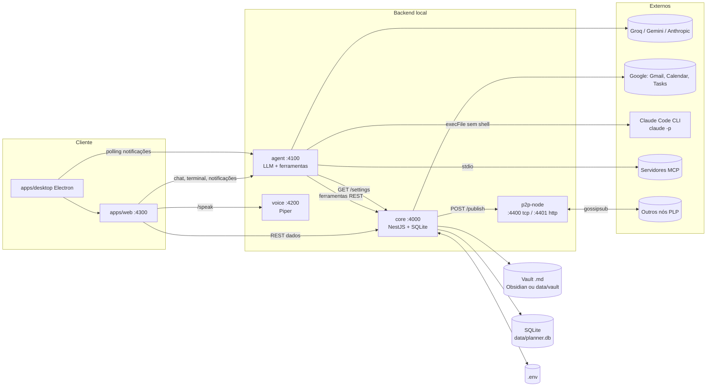
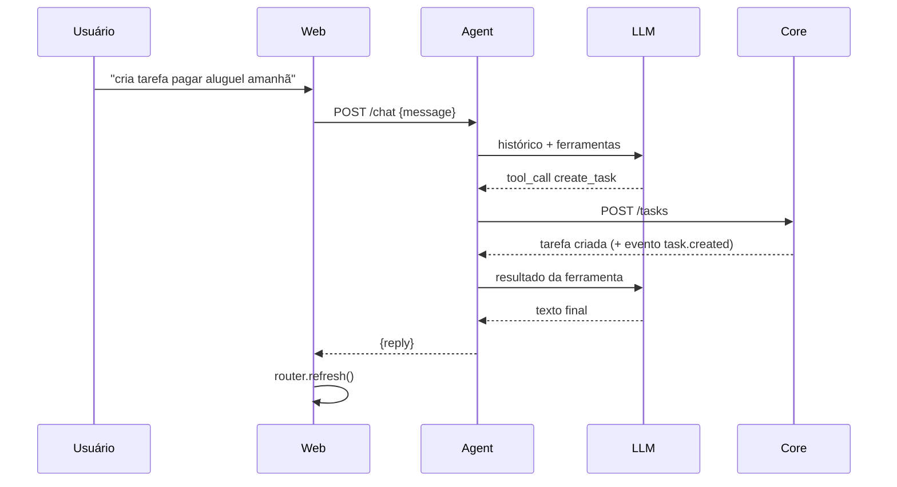
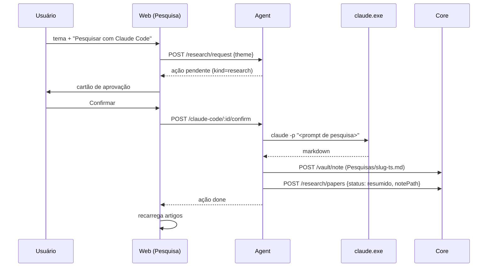
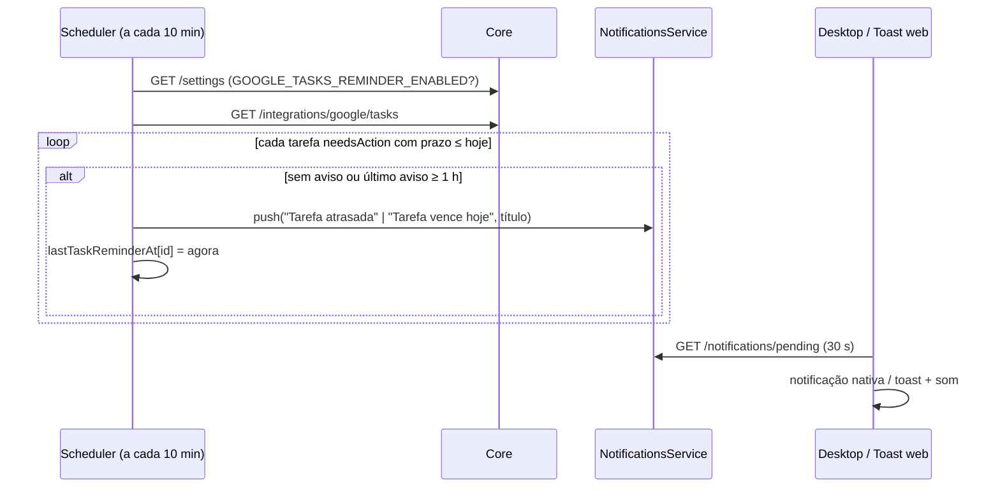

# Arquitetura

## 1. Visão geral

Monorepo `pnpm` com 5 pacotes de runtime, 1 pacote de tipos e 2 apps.

```
planner-life/
├── packages/
│   ├── shared/     tipos de domínio + protocolo PLP (compilado; os outros consomem o build)
│   ├── core/       NestJS + node:sqlite: fonte da verdade dos dados
│   ├── agent/      NestJS: LLM + ferramentas + MCP + Skills + Claude Code + rotinas proativas
│   ├── voice/      NestJS: TTS local (Piper), POST /speak → audio/wav
│   └── p2p-node/   libp2p: descoberta, gossipsub, ponte HTTP local
├── apps/
│   ├── web/        Next.js (App Router): dashboard
│   └── desktop/    Electron: sobe o backend e abre a dashboard numa janela
├── .mcp.json       servidores MCP que o agente conecta como cliente
└── docs/
```

| Pacote | Stack | Porta | Responsabilidade única |
| --- | --- | --- | --- |
| `@planner-life/core` | NestJS 10 + `node:sqlite` | 4000 | Guardar dados e regras; integrar Google e vault |
| `@planner-life/agent` | NestJS + SDKs Groq(OpenAI)/Gemini/Anthropic + MCP SDK | 4100 | Ser o "cérebro": conversar, chamar ferramentas, agendar avisos |
| `@planner-life/voice` | NestJS + Piper | 4200 | Texto → fala |
| `@planner-life/web` | Next.js | 4300 | Interface |
| `@planner-life/p2p-node` | libp2p (tcp, noise, yamux, mdns, gossipsub, identify) | 4400 (TCP), 4401 (HTTP local) | Transporte P2P |

## 2. Diagrama de componentes



## 3. Responsabilidades e fronteiras

### 3.1 Core (`packages/core`)

- **Único dono do banco e do `.env`.** Nenhum outro processo abre o SQLite; quem precisa de configuração pergunta por HTTP (`GET /settings`).
- Um módulo NestJS por domínio: `projects`, `tasks`, `memory`, `events`, `clients`, `subjects`, `study`, `research`, `messages`, `habits`, `vault`, `settings`, `integrations/google`, `p2p-bridge`. Infra global: `DatabaseModule` (token `PLANNER_DB`) e `EventBusModule`.
- Camadas: `controller` (validação de entrada, HTTP) → `service` (regras, eventos) → `repositories/*` (SQL puro, mapeamento linha→tipo).
- Toda mutação relevante: `EventsService.record()` (log durável em `events`) **e** `PlannerEventBus.publish()` (em memória → ponte P2P).

### 3.2 Agent (`packages/agent`)

- Não acessa o banco. Toda ferramenta é uma chamada REST ao Core (`coreFetch`), o que mantém o agente trocável (outro runtime poderia usar as mesmas rotas).
- `ToolRegistry` é o ponto único que os providers enxergam: `AGENT_TOOLS` (65) + `use_skill` + ferramentas MCP. Roteia `mcp__*`, `use_skill` e `run_claude_code` para tratadores próprios; o resto vai para `runTool`.
- `LlmProvider` (`groq`, `gemini`, `anthropic`) implementa o laço de tool-use; o schema de ferramenta é JSON Schema neutro adaptado por provider.
- `ClaudeCodeService`, `NotificationsService` e `SchedulerService` mantêm estado **em memória**.

### 3.3 Web (`apps/web`)

- `page.tsx` (Server Component) busca todos os dados em paralelo (`no-store`) e entrega ao `DashboardShell` (Client Component), que alterna entre as 11 views. Mutações chamam `lib/api.ts` e depois `router.refresh()`.
- `NEXT_PUBLIC_*_URL` definem para onde o navegador fala com cada serviço.

### 3.4 P2P (`packages/p2p-node`)

- Só transporte. `createPlannerNode` (libp2p) + `createHttpBridge` (`127.0.0.1:4401`). O envelope PLP é `{type, origin, createdAt, payload}` no tópico `planner-life/events/v1`.
- `peer:discovery` (mDNS) dispara `dial` explícito — só "descobrir" não conecta.

### 3.5 Desktop (`apps/desktop`)

- Não reimplementa nada: `spawn("pnpm", ["dev"])` e `spawn("pnpm", ["--filter","@planner-life/p2p-node","dev"])`, espera os health checks, abre a janela. Encerra a árvore com `taskkill /t /f` (Windows) ou `kill(-pid)`.
- `shell: true` aqui é seguro **porque os argumentos são literais fixos**. (Contraste com o Claude Code, §6.2.)

## 4. Fluxos principais

### 4.1 Mensagem de chat com ferramenta



Erros de ferramenta não derrubam a conversa: viram `{error: "..."}` devolvido ao modelo.

### 4.2 Pesquisa via Claude Code



### 4.3 Aviso de Google Tasks (repetição horária)



Concluir a tarefa no Google a tira da lista de `needsAction` e os avisos param.

### 4.4 Evento de domínio → rede

`Service.create()` → `events.record()` (SQLite) → `eventBus.publish()` →
`P2pBridgeService` → `POST 127.0.0.1:4401/publish` (timeout 1,5 s) →
`publishPlpEvent()` → gossipsub. Se o nó P2P estiver fora do ar, o Core segue
e só registra em `debug`.

### 4.5 OAuth do Google (multi-conta)

`GET /integrations/google/auth` redireciona ao consentimento com
`access_type=offline` e `prompt=consent select_account` (força o seletor de
conta) → `/callback?code=` troca o código, descobre o e-mail por `userinfo`,
grava o token em `integration_tokens` sob `google:<email>`, sincroniza o
Gmail dessa conta e redireciona para `WEB_APP_URL/?google=connected`. Tokens
expirados (ou a < 60 s de expirar) são renovados com o `refresh_token`.

## 5. Decisões de arquitetura

| Decisão | Motivo | Consequência |
| --- | --- | --- |
| `node:sqlite` em vez de ORM/driver nativo | Zero dependência nativa; roda em Raspberry Pi | Requer Node ≥ 22.5; API ainda experimental |
| Agente só fala HTTP com o Core | Trocar de runtime de agente sem mexer no dado | Uma chamada de rede por ferramenta |
| Schema de ferramenta neutro | Mesmas ferramentas em todos os providers | Adaptadores finos por provider |
| Groq via SDK `openai` com `baseURL` | API compatível; sem cliente HTTP manual | — |
| `.env` como fonte única de configuração | Simples, editável à mão | Serviços leem no boot; mudanças por UI exigem reinício (exceto o que é lido ao vivo) |
| Settings mascara segredos | Chave nunca volta ao navegador | Reenviar exige digitar de novo |
| Rotinas leem `GET /settings` a cada tick | Liga/desliga e horário valem sem reiniciar | Cron roda com mais frequência do que o evento em si |
| Vault = pasta de `.md` | Obsidian não precisa de API nem plugin | Sem índice; busca linear |
| Claude Code sem shell | Evitar injeção via prompt | Precisa localizar o `.exe` real no Windows |
| Pedido pendente para chamadas vindas da IA | Agente autônomo com acesso total à máquina é perigoso sem humano | Fila em memória |
| Web Audio para o som | Sem arquivo de áudio para versionar | Precisa de gesto do usuário para liberar |
| Ponte HTTP P2P só em loopback | Core e nó são processos distintos; sem auth | Só funciona na mesma máquina |
| Migrações por `PRAGMA table_info` | `CREATE TABLE IF NOT EXISTS` não altera tabelas existentes | Cada coluna nova precisa de uma verificação manual |

## 6. Modelo de segurança

### 6.1 Superfície de rede

Todos os serviços chamam `app.listen(port)` (todas as interfaces) e habilitam
CORS irrestrito. **Não há autenticação.** A ponte P2P é a única que escuta só
em `127.0.0.1`. Consequências e recomendações estão em
[SPEC.md §7–8 (L1)](SPEC.md). Para uso fora de uma rede confiável: bloquear
4000–4401 no firewall ou colocar um proxy com autenticação na frente.

### 6.2 Execução de comandos

- **Claude Code** — `execFile(claude.exe, ["-p", prompt])` **sem shell**. No Windows, `shell: true` faria o Node concatenar (não escapar) os argumentos, e o Node avisa isso com `DEP0190`. O `.cmd` do PATH também não pode ser executado sem shell (`spawn EINVAL`), então o serviço replica a lógica do shim: escolhe a versão mais recente em `%APPDATA%\Claude\claude-code\` e chama o `.exe`. Fora do Windows usa `claude` do PATH.
- **Piper** — `spawn(bin, ["--model", m, "--output_file", f])` sem shell; o texto vai por `stdin`.
- **MCP** — `StdioClientTransport` executa os comandos definidos em `.mcp.json` (arquivo confiável, do usuário).

### 6.3 Dados sensíveis

| Dado | Onde | Proteção |
| --- | --- | --- |
| API keys e OAuth client secret | `.env` | Fora do git (`.gitignore`); mascaradas em `/settings` |
| Tokens OAuth Google | SQLite `integration_tokens` | Só em disco local; sem criptografia em repouso |
| Conteúdo de e-mails | SQLite (`messages`, só assunto/prévia) e Gmail ao vivo (corpo) | Corpo não é persistido |
| Notas | Vault em disco | Bloqueio de *path traversal* |

### 6.4 Escopos OAuth solicitados

`gmail.readonly`, `calendar` (escrita), `tasks`, `userinfo.email`.

## 7. Portas e processos

| Serviço | Porta | Escuta | Origem da porta |
| --- | --- | --- | --- |
| core | 4000 | todas | `CORE_PORT` |
| agent | 4100 | todas | `AGENT_PORT` |
| voice | 4200 | todas | `VOICE_PORT` |
| web | 4300 | todas | fixa em `apps/web/package.json` (`next dev -p 4300`); a variável `WEB_PORT` do `.env` **não é lida por nenhum código** |
| p2p TCP | 4400 | todas | `P2P_TCP_PORT` |
| p2p HTTP | 4401 | 127.0.0.1 | `P2P_HTTP_PORT` |

`pnpm dev` sobe shared (watch), core, agent, web e voice com `concurrently`.
O `p2p-node` é iniciado à parte (`pnpm dev:p2p`) — o app desktop inicia os dois.
