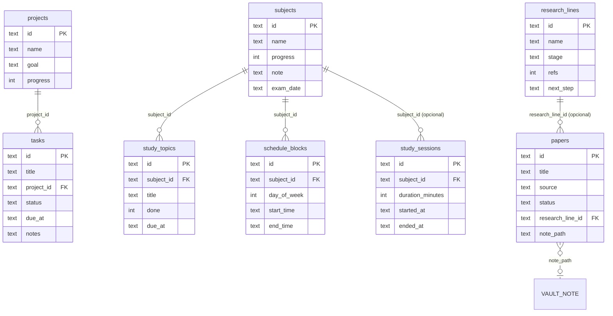

# Modelo de dados

Banco: SQLite em `DB_PATH` (padrão `./data/planner.db`), aberto pelo Core com
`node:sqlite` (`DatabaseSync`). O schema é criado por `CREATE TABLE IF NOT
EXISTS` em `packages/core/src/db.ts`; colunas adicionadas depois passam por
migração idempotente (§4). Os tipos TypeScript equivalentes estão em
`packages/shared/src/types.ts`.

- IDs são `TEXT` (UUID) gerados no Core, exceto mensagens do Gmail (`gmail-<conta>-<idGmail>`).
- Datas são `TEXT` ISO 8601. Colunas `*_at` de auditoria: `created_at`, `updated_at`.
- Convenção de mapeamento: coluna `snake_case` → campo `camelCase`.
- `PRAGMA foreign_keys` **não** está habilitado: as `REFERENCES` documentam a intenção, mas o banco não as impõe. As cascatas são feitas na camada de repositório (§3).

## 1. Diagrama



Tabelas independentes: `memory_entries`, `events`, `clients`, `messages`,
`habits`, `integration_tokens`.

## 2. Tabelas

### projects
| Coluna | Tipo | Notas |
| --- | --- | --- |
| id | TEXT PK | |
| name | TEXT NOT NULL | |
| goal | TEXT | objetivo |
| progress | INTEGER | 0–100, padrão 0 |
| created_at / updated_at | TEXT NOT NULL | |

### tasks
| Coluna | Tipo | Notas |
| --- | --- | --- |
| id | TEXT PK | |
| title | TEXT NOT NULL | |
| project_id | TEXT → projects | opcional |
| status | TEXT | `pending` (padrão), `in_progress`, `done`, `cancelled` |
| due_at | TEXT | prazo |
| notes | TEXT | |

### memory_entries
`id`, `content`, `tags` (TEXT com array JSON, padrão `'[]'`), `source` (`user` / `personal-agent`), `created_at`.

### events
Log durável de domínio: `id`, `type` (um `PlpEventType`), `payload` (JSON), `origin` (padrão `planner-core`), `created_at`.

### clients (CRM)
`id`, `name`, `stage` (`lead` padrão, `contact`, `proposal`, `closed`), `value` (REAL, R$), `next_action`, `next_action_at`, `created_at`, `updated_at`.

### subjects (disciplinas)
`id`, `name`, `progress` (0–100), `note`, `exam_date` *(migração)*, `created_at`, `updated_at`.

### study_topics
| Coluna | Tipo | Notas |
| --- | --- | --- |
| subject_id | TEXT NOT NULL → subjects | |
| title | TEXT NOT NULL | |
| done | INTEGER | 0/1 |
| due_at | TEXT *(migração)* | se preenchido, o tópico é uma **entrega/leitura** com prazo |

### schedule_blocks
`id`, `subject_id`, `day_of_week` (0=domingo … 6=sábado), `start_time` / `end_time` (`HH:MM`), `created_at`.

### study_sessions
`id`, `subject_id` (opcional), `duration_minutes`, `started_at`, `ended_at`, `created_at`.

### research_lines
`id`, `name`, `stage`, `refs` (INTEGER, padrão 0), `next_step`, `created_at`, `updated_at`.

### papers
| Coluna | Tipo | Notas |
| --- | --- | --- |
| title | TEXT NOT NULL | |
| source | TEXT | ex.: arXiv, IEEE |
| status | TEXT | `na_fila` (padrão), `em_leitura`, `resumido` |
| research_line_id | TEXT → research_lines | opcional |
| note_path | TEXT *(migração)* | caminho da nota no vault, ex.: `Pesquisas/tema-1726…md` |

### messages (Inbox)
`id`, `from_name`, `subject`, `snippet`, `tag` (para Gmail: e-mail da conta), `action`, `handled` (0/1), `received_at`, `created_at`. O corpo do e-mail **não** é guardado — é buscado ao vivo no Gmail.

### habits
`id`, `name`, `unit` (padrão `''`), `target` (REAL), `current` (REAL), `created_at`, `updated_at`.

### integration_tokens
`provider` PK (`google:<email>`), `access_token`, `refresh_token`, `expires_at`, `scope`, `updated_at`.

## 3. Regras de exclusão (cascatas feitas em código)

| Ao excluir | Efeito |
| --- | --- |
| `projects` | Exclui as `tasks` do projeto |
| `subjects` | Exclui seus `study_topics` e `schedule_blocks`. **Não** exclui `study_sessions` (ficam com `subject_id` órfão) |
| `research_lines` | `papers.research_line_id` vira `NULL`; artigos permanecem |
| `papers` | Exclui a **nota do vault** em `note_path` (falha é só log) e publica `paper.deleted` |
| `messages` | Apaga só a cópia local; nada muda no Gmail |
| `integration_tokens` | Desconecta a conta Google |

## 4. Migrações

`migrate(db)` roda em toda abertura do banco e só executa `ALTER TABLE` se a
coluna ainda não existir (`PRAGMA table_info`). Atuais:

| Tabela | Coluna |
| --- | --- |
| `papers` | `note_path` |
| `subjects` | `exam_date` |
| `study_topics` | `due_at` |

**Para adicionar uma coluna:** inclua-a no `CREATE TABLE` (bancos novos) **e**
uma verificação em `migrate()` (bancos existentes).

## 5. Vault (arquivos)

Não é banco: pasta de arquivos `.md` (`OBSIDIAN_VAULT_PATH` ou `data/vault`).
Notas de pesquisa ficam em `Pesquisas/<slug>-<timestamp>.md`, onde `slug` é o
título em minúsculas, sem acento, `[^a-z0-9]` → `-`, máximo 60 caracteres. O
título de uma nota é o primeiro `# Título`; na ausência, o nome do arquivo.

## 6. Eventos PLP

Toda mutação grava em `events` e publica no barramento. Tipos
(`PlpEventType`):

| Grupo | Tipos |
| --- | --- |
| Tarefas | `task.created`, `task.updated`, `task.completed`, `task.deleted` |
| Projetos | `project.created`, `project.updated`, `project.deleted` |
| Memória | `memory.created`, `memory.deleted` |
| CRM | `client.created`, `client.updated`, `client.deleted` |
| Disciplinas | `subject.created`, `subject.updated`, `subject.deleted` |
| Pesquisa | `research_line.created/updated/deleted`, `paper.created/updated/deleted` |
| Hábitos | `habit.created`, `habit.updated`, `habit.deleted` |
| Inbox | `message.synced`, `message.handled`, `message.deleted` |
| Estudo | `study_topic.created/updated/deleted`, `schedule_block.created/deleted`, `study_session.created/deleted` |
| Sistema (reservados) | `agent.started`, `agent.finished`, `device.connected`, `device.disconnected`, `message.received` |

### Envelope PLP

```json
{
  "type": "task.created",
  "origin": "pc-principal",
  "createdAt": "2026-09-18T13:10:00.000Z",
  "payload": { "taskId": "…", "title": "…" }
}
```

Tópico gossipsub: `planner-life/events/v1` (`PLP_TOPIC`). `origin` é o
`P2P_NODE_NAME` do nó que publicou (o `origin` gravado na tabela `events` é
`planner-core`).

## 7. Tipos que só existem na integração com o Google

| Tipo | Campos |
| --- | --- |
| `CalendarEvent` | `id` (`calendarId:eventId`), `title`, `start`, `end?`, `location?`, `account`, `calendarName` |
| `GoogleTask` | `id`, `title`, `notes?`, `due?` (data, sem horário), `status` (`needsAction` \| `completed`), `account` |
| `GoogleAccount` | `email`, `connectedAt` |

Não são persistidos (exceto os tokens): são buscados ao vivo.
